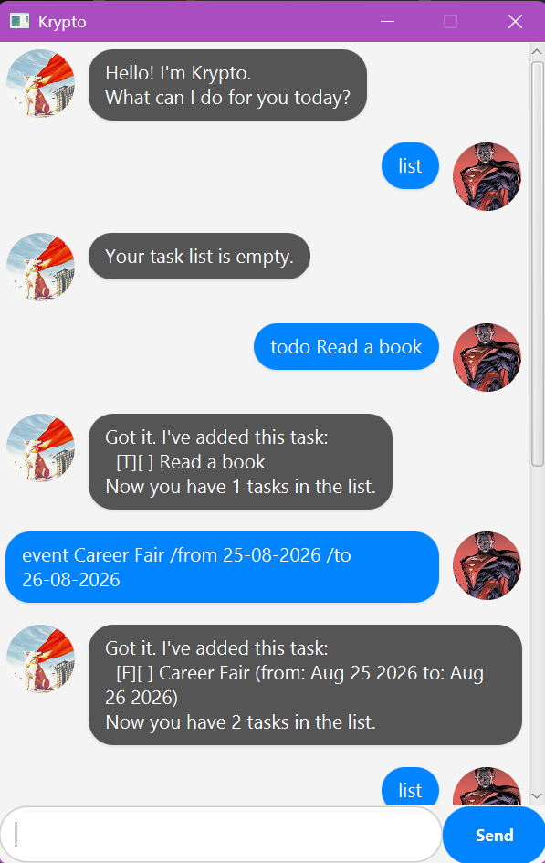

# Krypto - Your Personal Task Manager

Krypto is a task management application designed for users who prefer typing over mouse interactions. It provides a sleek Graphical User Interface (GUI) while retaining the speed and efficiency of a Command Line Interface (CLI). 



## Table of Contents
* [Quick Start](#quick-start)
* [Features & Usage](#features--usage)
  * [Adding Tasks](#1-adding-tasks)
  * [Viewing Tasks](#2-viewing-tasks)
  * [Managing Tasks](#3-managing-tasks)
  * [Sorting Tasks](#4-sorting-tasks)
  * [Exiting](#5-exiting-the-app)
* [Command Summary](#command-summary)

---

## Quick Start

1. Ensure you have **Java 17** or above installed on your computer.
2. Download the latest `krypto.jar` from the [Releases](../../releases) page.
3. Open a terminal or command prompt, navigate to the folder where you downloaded the file, and run:
   ```bash
   java -jar krypto-0.1.0.jar
   ```
4. Type a command in the input box and press **Enter** to execute it!

---

## Features & Usage

Notes about the command format:
* Words in `<angle_brackets>` are the parameters to be supplied by the user.
* Dates must strictly follow the `dd-mm-yyyy` format (e.g., `25-12-2026`).

### 1. Adding Tasks
Krypto supports three types of tasks: Todos, Deadlines, and Events.

#### **Todo**
Adds a simple task without any date attached.
* **Format:** `todo <description>`
* **Example:** `todo Read CS2103T textbook`

#### **Deadline**
Adds a task that needs to be done *by* a specific date.
* **Format:** `deadline <description> /by <dd-mm-yyyy>`
* **Example:** `deadline Submit iP /by 20-02-2026`

#### **Event**
Adds a task that starts and ends at specific dates.
* **Format:** `event <description> /from <dd-mm-yyyy> /to <dd-mm-yyyy>`
* **Example:** `event Career Fair /from 25-08-2026 /to 26-08-2026`

### 2. Viewing Tasks

#### **List all tasks**
Displays a numbered list of all tasks currently in your manager.
* **Format:** `list`

#### **Find a task**
Searches for tasks whose descriptions contain the given keyword.
* **Format:** `find <keyword>`
* **Example:** `find book` (Returns all tasks containing the word "book")

### 3. Managing Tasks

#### **Mark a task as done**
Marks a task as completed (indicated by an `[X]`).
* **Format:** `mark <task_number>`
* **Example:** `mark 1` (Marks the 1st task in the list as done)

#### **Unmark a task**
Marks a task as incomplete (indicated by an `[ ]`).
* **Format:** `unmark <task_number>`
* **Example:** `unmark 1`

#### **Delete a task**
Removes a task from the list permanently.
* **Format:** `delete <task_number>`
* **Example:** `delete 2` (Removes the 2nd task in the list)

### 4. Sorting Tasks
Sorts all tasks in the list chronologically. Tasks with dates (Deadlines/Events) will appear first, sorted from earliest to latest. Tasks without dates (Todos) will appear at the bottom, sorted alphabetically.
* **Format:** `sort`

### 5. Exiting the app
Exits the program securely.
* **Format:** `bye`

---

## Command Summary

| Action | Format | Example |
|--------|--------|---------|
| **Todo** | `todo <description>` | `todo read book` |
| **Deadline** | `deadline <description> /by <dd-mm-yyyy>` | `deadline submit iP /by 20-02-2026` |
| **Event** | `event <description> /from <dd-mm-yyyy> /to <dd-mm-yyyy>` | `event meeting /from 01-03-2026 /to 02-03-2026` |
| **List** | `list` | `list` |
| **Mark** | `mark <task_number>` | `mark 1` |
| **Unmark** | `unmark <task_number>` | `unmark 1` |
| **Delete** | `delete <task_number>` | `delete 1` |
| **Find** | `find <keyword>` | `find book` |
| **Sort** | `sort` | `sort` |
| **Exit** | `bye` | `bye` |
